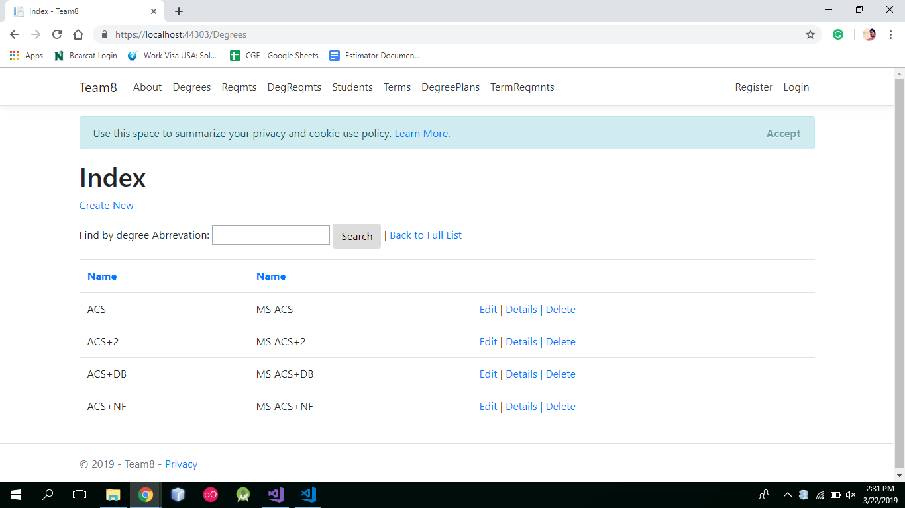
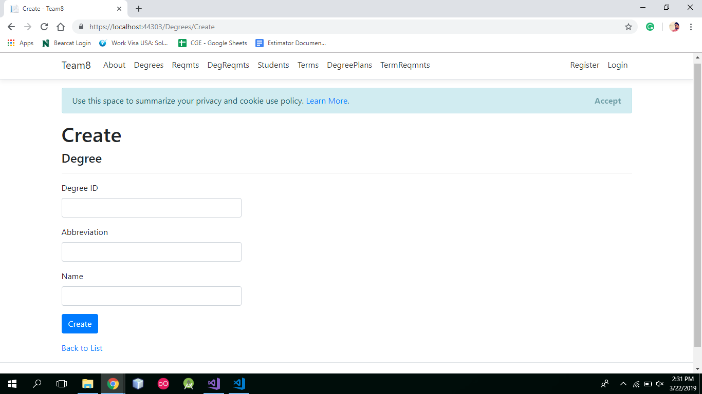

# Team8 Degree Planner

## Team Members and Assigned Tasks
- Chaithanya Cherukuru (Worked on StudentTerm and DegreeRequirement Models and Sample data)
- Girish Guntuku (Worked on Degree and DegreePlan Models and Data)
- Midhun Kumar Kurapati(Worked on Student and Requirement Models and Data)
- Pappu Sah(Worked on DegreeTermRequirment Model and Data)

## How to clone and run the App 
- Clone the app from our git repository (https://github.com/cherukuruchaithanya/Team8)
- Start the solution from visual studio
- Run the app, which opens the app in the browser.

## Issue Tracker
https://github.com/cherukuruchaithanya/Team8/issues

## Screenshots

 
 

